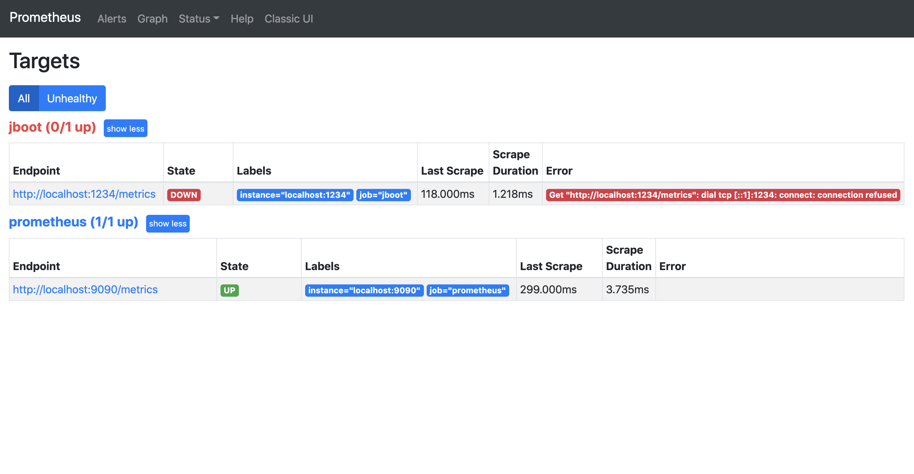
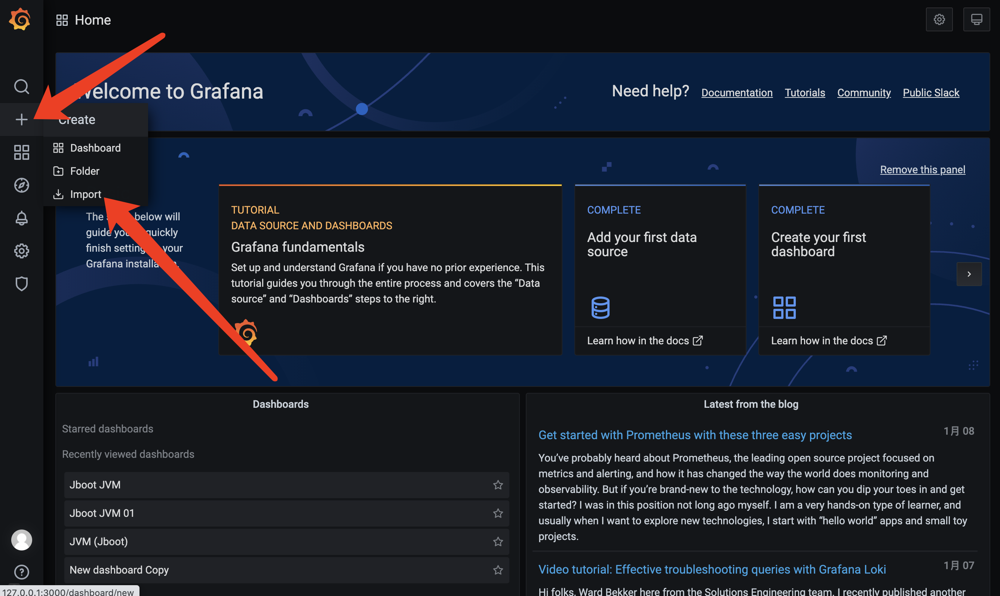
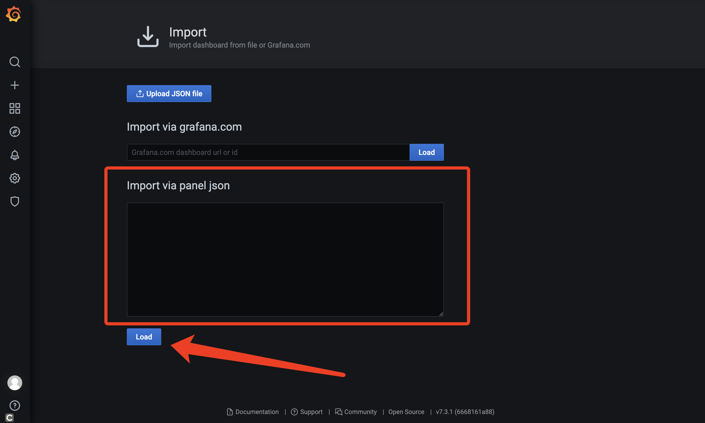
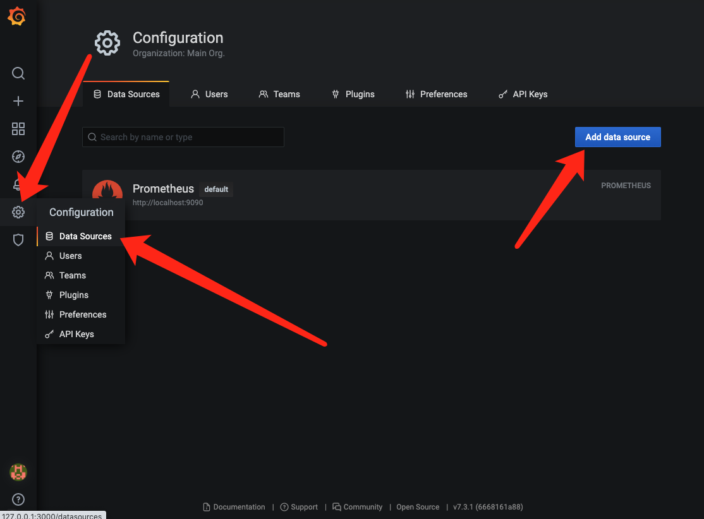
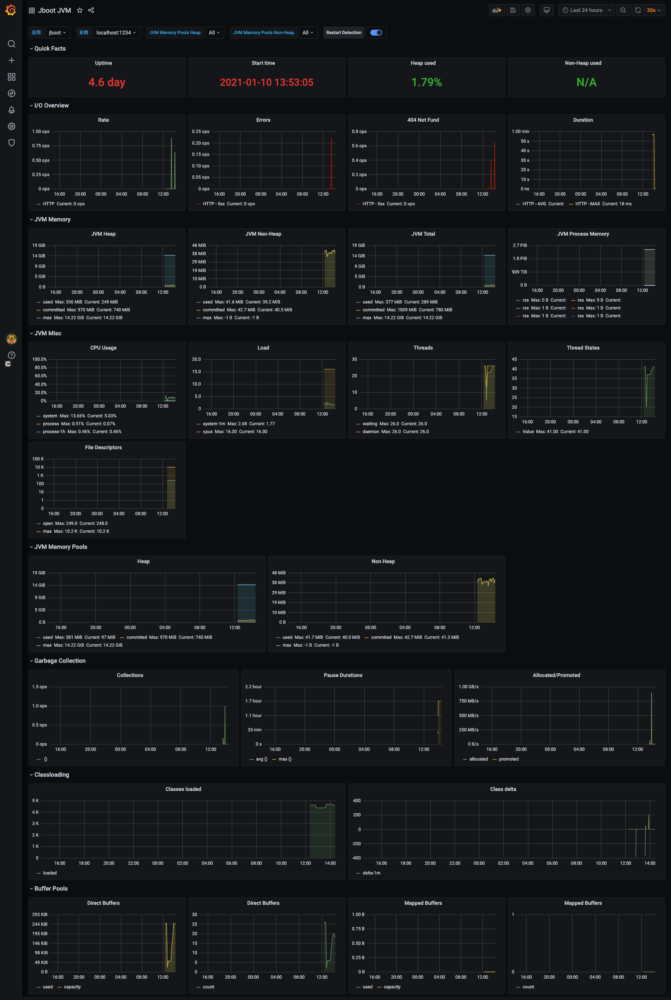

# Jboot 与 Metrics

Jboot 内置了一套监控机制，可以用来监控 Controller、Service 等的 API 访问情况，同时 Jboot 提供了如下 5 个注解，方便用户对API自由监控。

- @EnableMetricConcurrency
- @EnableMetricCounter
- @EnableMetricHistogram
- @EnableMetricMeter
- @EnableMetricTimer

这些监控的数据，我们可以输出到 slf4j 日志，可以输入到网页的 json，也可以通过配置直接把数据输出到 prometheus，然后使用 grafana 面板来进行可视化的数据监控，如下图。


## Metrics 输出到日志

这是最简单的一种方法，我们只需要在 jboot.properties 添加如下配置:

```properties
jboot.metric.enable=true
jboot.metric.reporter=slf4j
```

然后在 Controller 或者 Service 添加 Jboot 提供的注解，例如：

```java
@RequestMapping("/")
public class MetricsController extends JbootController {

    @EnableMetricCounter
    @EnableMetricConcurrency
    public void index() {
        renderText("metrics index. ");
    }
}
```

此时，启动 jboot 应用后，当访问 `http://127.0.0.1:8080/` ，控制台（日志） 会定时输出 `http://127.0.0.1:8080/` 的并发量和访问次数。（默认情况下是1分钟输出一次日志）。

如果我们需要通过网页来查看监控的 json 数据，可以添加配置

```properties
boot.metric.adminServletMapping = metrics.admin
```

此时，我们可以通过 `http://127.0.0.1:8888/metrics.admin` 来查看 `index()` 这个方法的访问次数和并发量。


## Metrics 输出到 Grafana

Grafana 是一个开源的度量分析与可视化套件。经常被用作基础设施的时间序列数据和应用程序分析的可视化，它在其他领域也被广泛的使用包括工业传感器、家庭自动化、天气和过程控制等。

Grafana 支持许多不同的数据源，比如： Graphite，InfluxDB，OpenTSDB，Prometheus，Elasticsearch，CloudWatch 和 KairosDB 等。每个数据源都有一个特定的查询编辑器，该编辑器定制的特性和功能是公开的特定数据来源。

需要注意的是：Grafana 并没有接收数据的能力，因此，Jboot 的方案是先把数据输出到 Prometheus (或者 influxdb），再配置 Grafana 来读取 Prometheus (或者 influxdb） 的数据。

因此，在 Grafana 正常显示 Jboot 数据之前，先把 Grafana 和 Prometheus 启动起来。

**启动 Prometheus ：**
- 1、下载 Prometheus 到本地，下载地址：https://prometheus.io/download/
- 2、进入到 Prometheus 的解压目录，修改 prometheus.yml 文件，内容如下：

```yml
# my global config
global:
  scrape_interval:     15s # Set the scrape interval to every 15 seconds. Default is every 1 minute.
  evaluation_interval: 15s # Evaluate rules every 15 seconds. The default is every 1 minute.
  # scrape_timeout is set to the global default (10s).

# Alertmanager configuration
alerting:
  alertmanagers:
  - static_configs:
    - targets:
      # - alertmanager:9093

# Load rules once and periodically evaluate them according to the global 'evaluation_interval'.
rule_files:
  # - "first_rules.yml"
  # - "second_rules.yml"

# A scrape configuration containing exactly one endpoint to scrape:
# Here it's Prometheus itself.
scrape_configs:
  # The job name is added as a label `job=<job_name>` to any timeseries scraped from this config.
  - job_name: 'prometheus'

    # metrics_path defaults to '/metrics'
    # scheme defaults to 'http'.

    static_configs:
    - targets: ['localhost:9090']

    # The job name is added as a label `job=<job_name>` to any timeseries scraped from this config.
  - job_name: 'jboot'
    static_configs:
    - targets: ['localhost:1234']

```

- 3、通过 ./prometheus --config.file=prometheus.yml 启动 Prometheus
- 4、启动成功后，我们可以通过 `http://127.0.0.1:9090` 访问到 Prometheus 的查询页面，在 `http://127.0.0.1:9090/targets` 可以看到如下图所示：



其中，jboot 应用是红色的，state 处于 down 的状态，原因是 Jboot 应用还未启动。


最后，需要在 jboot 应用添加如下依赖：

```xml
<dependency>
    <groupId>io.prometheus</groupId>
    <artifactId>simpleclient_dropwizard</artifactId>
    <version>0.11.0</version>
    <scope>provided</scope>
</dependency>

<dependency>
    <groupId>io.prometheus</groupId>
    <artifactId>simpleclient_httpserver</artifactId>
    <version>0.11.0</version>
    <scope>provided</scope>
</dependency>
```

和 在 jboot.properties 添加如下配置：

```properties
jboot.metric.enable=true
jboot.metric.reporter=prometheus
```

当然，要监控某个方法的相关输入，还需要通过注解来进行配置

```java
@RequestMapping("/")
public class MetricsController extends JbootController {

    @EnableMetricCounter
    @EnableMetricConcurrency
    @EnableMetricTimer
    @EnableMetricHistogram
    @EnableMetricMeter
    public void index() {
        renderText("metrics index. ");
    }
}
```

启动 jboot，当访问 `http://127.0.0.1:8080/` 之后， jboot 就会把 Metrics 的数据输出到 prometheus ，此时我们就可以配置 grafana 读取 prometheus 的数据了。

**配置 Grafana 读取 Prometheus 的数据**
- 启动 Grafana 

```shell
docker run -d -p 3000:3000 grafana/grafana
```

- 进入 Grafana 的后台
  
  通过网址 `http://127.0.0.1:3000` 可以访问到 Grafana，首次访问需要登录，默认账号和密码都是 admin。

- 导入 Jboot JVM 的 Grafana 大盘配置





- 为 Grafana 添加 Prometheus 的数据源




在 `Import via panel json` 中输入  `https://gitee.com/JbootProjects/jboot/raw/master/doc/jboot_jvm_grafana.json` 中的内容，然后点击 load，就可以见到如下的 JVM 大图了。


 

## Metrics 输出到 Graphite

Graphite 是一个开源实时的、显示时间序列度量数据的图形系统。Graphite 并不收集度量数据本身，而是像一个数据库，通过其后端接收度量数据，然后以实时方式查询、转换、组合这些度量数据。Graphite支持内建的Web界面，它允许用户浏览度量数据和图。

Graphite 有三个主要组件组成：

- 1）Graphite-Web
这是一个基于Django的Web应用，可以呈现图形和仪表板

- 2）Carbon
这是一个度量处理守护进程

- 3）Whisper
这是一个基于时序数据库的库

在开始之前，我们需要启动 Graphite

```shell
docker run -d\
 --name graphite\
 --restart=always\
 -p 80:80\
 -p 2003-2004:2003-2004\
 -p 2023-2024:2023-2024\
 -p 8125:8125/udp\
 -p 8126:8126\
 graphiteapp/graphite-statsd
```


然后，在我们自己的项目添加如下的 Maven 依赖。

```xml
<dependency>
    <groupId>io.dropwizard.metrics</groupId>
    <artifactId>metrics-graphite</artifactId>
    <version>4.1.0</version>
</dependency>
```

最后在 jboot.properties 添加如下配置：

```properties
jboot.metric.enable=true
jboot.metric.reporter=graphite
jboot.metric.reporter.graphite.host=127.0.0.1
jboot.metric.reporter.graphite.port=2003
jboot.metric.reporter.graphite.prefixedWith=
```

Java 上的配置就和以上输出到 日志 的一样了。

另外：Jboot 把数据输出到 graphite 之后，我们可以配置 grafana 来读取 graphite 的数据，相关文档请参考：https://grafana.com/docs/features/datasources/graphite/