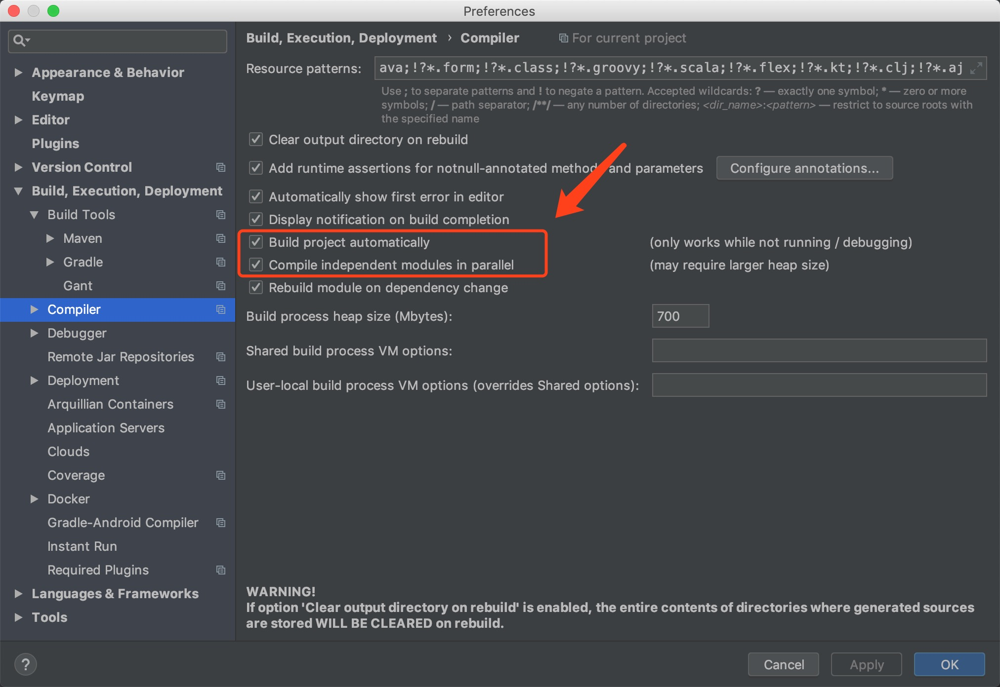

# 热加载


## 目录

- 描述
- Maven 多模块（ module ）下资源文件热加载
- 常见错误

## 描述

在 Jboot 开发模式下，默认开启热加载功能，若要关闭热加载功能，可以添加配置 `undertow.devMode = false` , 或者通过 `jboot.app.mode = product` 配置修改当前应用为生产环境。


## Maven 多模块（ module ）下资源文件热加载

在 Jboot 中，内置了一个类叫 `JbootResourceLoader`，只有在 dev 模式下才生效。

`JbootResourceLoader` 在 Jboot 启动的时候，会自动去监控各个 Maven 模块下的 `src/main/webapp` 目录的资源文件，当发生变化的时候，会自动同步到 `classpath:webapp` 下，从而实现静态文件的热加载功能。

倘若你的资源文件不在 `src/main/webapp` 目录，则需要配置 `jboot.app.resourcePathName = myResourcePath` ，那么，当 Jboot 启动的时候则会启动去监控各个模块的 `src/main/myResourcePath` 目录，并自动同步到 `classpath:myResourcePath` 下。

默认是 `src/main/webapp`，若你的资源文件在 `src/main/webapp` 目录下，不需要任何配置即可以实现资源文件的热加载功能。


## 常见错误

- **错误1：LinkpageError 错误**
开启热加载的时候，可能会出现 `LinkpageError` 等异常，这个原因是由于用户自定义的 Class 没有被负责热加载的 `HotSwapClassLoader` 接管，需要在 `undertow.txt` 或者 `jboot.properties` 文件添加如下配置：

```
undertow.hotSwapClassPrefix = xxx1.com, xxx2.com
```

- **错误2：没有热加载**
  在 idea 开发工具中，可能会出现未正确进行热加载的情况，一般是没有配置 idea 的自动编译功能。

