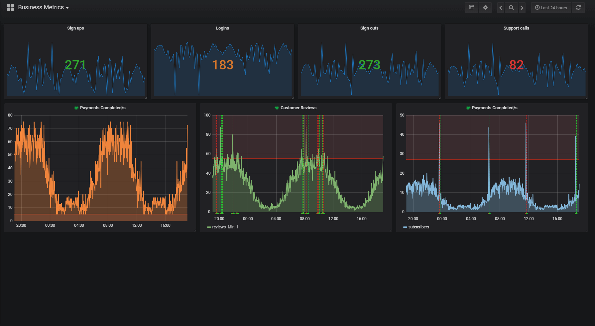

# Jboot 与 Metrics

Jboot 内置了一套监控机制，可以用来监控 Controller、Service 等的 API 访问情况，同时 Jboot 提供了如下 5 个注解，方便用户对API自由监控。

- @EnableMetricConcurrency
- @EnableMetricCounter
- @EnableMetricHistogram
- @EnableMetricMeter
- @EnableMetricTimer

这些监控的数据，我们可以输出到 slf4j 日志，可以输入到网页的json，也可以通过配置直接把数据输出到 grafana，使用 grafana 面板来进行可视化的数据监控，如下图。




## Metrics 输出到日志

这是最简单的一种方法，我们只需要在 jboot.properties 添加如下配置:

```
jboot.metric.url=-/metrics_admin
jboot.metric.reporter=slf4j
```

然后在 Controller 或者 Service 添加 Jboot 提供的注解，例如：

```java
@RequestMapping("/")
public class MetricsController extends JbootController {

    @EnableMetricCounter
    @EnableMetricConcurrency
    public void index() {
        renderText("metrics index. ");
    }
}
```

此时，启动 jboot 应用后，当访问 `http://127.0.0.1:8080/` ，控制台（日志） 会定时输出 `http://127.0.0.1:8080/` 的并发量和访问次数。（默认情况下是1分钟输出一次日志）。

同时，由于我们配置了 `jboot.metric.url=-/metrics_admin` ，我们可以通过 `http://127.0.0.1:8888/metrics_admin` 来查看 `index()` 这个方法的访问次数和并发量。


## Metrics 输出到 grafana

grafana 并没有接收数据的能力，因此，jboot 的方案是先数据输出到 influxdb，在配置 grafana 来读取 influxdb 的数据。

因此，在 grafana 正常显示 jboot 数据之前，先把 grafana 和 influxdb 启动起来。

**启动 influxdb ：**

```
docker run -d -p 8086:8086 -p 8083:8083 \
     -e INFLUXDB_ADMIN_ENABLED=true \
     -e INFLUXDB_DB=metricsDb \
     -e INFLUXDB_ADMIN_USER=admin \
     -e INFLUXDB_ADMIN_PASSWORD=123456 \
     -e INFLUXDB_USER=fuhai \
     -e INFLUXDB_USER_PASSWORD=123456 \
     influxdb
```

**启动 grafana ：**

```
docker run -d -p 3000:3000 grafana/grafana
```

同时，需要在 jboot 应用添加如下依赖：

```xml
<dependency>
    <groupId>com.github.davidb</groupId>
    <artifactId>metrics-influxdb</artifactId>
    <version>1.1.0</version>
</dependency>
```

和 在 jboot.properties 添加如下配置：

```
jboot.metric.url=/metrics_admin
jboot.metric.reporter=influxdb
jboot.metric.reporter.influxdb.host=127.0.0.1
jboot.metric.reporter.influxdb.port=8086
jboot.metric.reporter.influxdb.user=admin
jboot.metric.reporter.influxdb.password=123456
jboot.metric.reporter.influxdb.dbName=metricsDb
```

当然，要监控某个方法的相关输入，还需要通过注解来进行配置

```java
@RequestMapping("/")
public class MetricsController extends JbootController {

    @EnableMetricCounter
    @EnableMetricConcurrency
    @EnableMetricTimer
    @EnableMetricHistogram
    @EnableMetricMeter
    public void index() {
        renderText("metrics index. ");
    }
}
```

启动 jboot，当访问 `http://127.0.0.1:8080/` 之后， jboot 就会把Metrics的数据输出到 influxdb，此时我们就可以配置 grafana 读取 influxdb 的数据了。

更多关于 grafana 读取 influxdb 的文档请参考 https://grafana.com/docs/features/datasources/influxdb/ 。

## Metrics 输出到 graphite

在开始之前，需要添加如下的 Maven 依赖。

```xml
<dependency>
    <groupId>io.dropwizard.metrics</groupId>
    <artifactId>metrics-graphite</artifactId>
    <version>4.1.0</version>
</dependency>
```

**启动 graphite**

```
docker run -d\
 --name graphite\
 --restart=always\
 -p 80:80\
 -p 2003-2004:2003-2004\
 -p 2023-2024:2023-2024\
 -p 8125:8125/udp\
 -p 8126:8126\
 graphiteapp/graphite-statsd
```

在 jboot.properties 添加如下配置：

```
jboot.metric.url=/metrics_admin
jboot.metric.reporter=graphite
jboot.metric.reporter.graphite.host=127.0.0.1
jboot.metric.reporter.graphite.port=2003
jboot.metric.reporter.graphite.prefixedWith=
```

Java 上的配置就和以上输出到 日志 的一样了。

另外：Jboot 把数据输出到 graphite 之后，我们可以配置 grafana 来读取 graphite 的数据，相关文档请参考：https://grafana.com/docs/features/datasources/graphite/